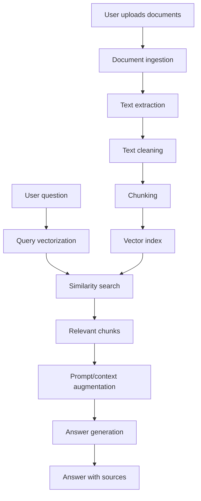

# Smart Document Analyzer Using RAG

This project is an internship-ready AI and cloud computing application. It lets users upload documents, ask questions, and receive answers grounded in the uploaded content using a Retrieval-Augmented Generation workflow.

## Features

- Upload PDF, DOCX, TXT, or Markdown files.
- Extract and clean document text.
- Split long documents into overlapping chunks.
- Build a local vector index for retrieval.
- Ask natural language questions about the document.
- Generate answers from the most relevant document chunks.
- Optionally use a cloud LLM by configuring environment variables.
- View source chunks used for each answer.

## Architecture



## RAG Workflow

1. The user uploads a document.
2. The app extracts readable text from the file.
3. The text is cleaned and divided into smaller chunks.
4. The chunks are converted into searchable vectors.
5. The user asks a question.
6. The question is compared with stored chunks using similarity search.
7. The most relevant chunks are retrieved.
8. The app generates an answer using the retrieved context.
9. The answer and source chunks are displayed to the user.

## Technology Stack

- Python
- Streamlit
- pypdf
- python-docx
- Optional OpenAI-compatible cloud LLM configuration

The starter version uses a local TF-IDF vector index so the project can run without a paid API key. For a production cloud version, the vector index can be replaced with Chroma, Pinecone, Azure AI Search, or another managed vector database.

## Project Structure

```text
smart-document-analyzer-rag/
  app.py
  requirements.txt
  .env.example
  src/
    document_loader.py
    text_splitter.py
    vector_store.py
    llm.py
    rag_pipeline.py
```

## Local Setup

Create and activate a virtual environment:

```bash
python -m venv .venv
.venv\Scripts\activate
```

Install dependencies:

```bash
pip install -r requirements.txt
```

Run the app:

```bash
streamlit run app.py
```

On this Windows machine, the app was tested with a virtual environment named `.venv-win`:

```bash
.venv-win\Scripts\python.exe -m streamlit run app.py
```

## Optional Cloud LLM Setup

Create a `.env` file from `.env.example`:

```bash
copy .env.example .env
```

Then set:

```text
OPENAI_API_KEY=your_api_key_here
OPENAI_MODEL=your_model_name_here
```

If these values are empty, the app uses local extractive answer mode.

## Cloud Deployment Plan

The project can be deployed on cloud platforms such as Azure App Service, AWS Elastic Beanstalk, Google Cloud Run, Render, or a virtual machine.

Recommended cloud design:

- Host the Streamlit app on a cloud app service or container platform.
- Store uploaded files in cloud object storage such as Azure Blob Storage, AWS S3, or Google Cloud Storage.
- Use a managed vector database such as Pinecone, Azure AI Search, or a hosted Chroma service.
- Use a cloud LLM provider for answer generation.
- Store secrets such as API keys in the cloud provider's secret manager.

## Future Enhancements

- Add user authentication.
- Add persistent document history.
- Replace the local index with a managed vector database.
- Add document summarization.
- Add source page numbers for PDF answers.
- Add support for scanned PDFs using OCR.
- Deploy using Docker and a CI/CD pipeline.
